# 7. Módulos del sistema (con capturas)

Capturas reales del sistema en funcionamiento. Cada módulo indica qué hace cada rol.

## 7.1 Módulo de Matrícula

- **Estudiante:** solicita matrícula y descarga su ficha oficial.
- **Administrador:** valida requisitos, registra pagos y genera la ficha oficial.
- **Dirección:** supervisa estadísticas de matrícula.

**Vista del estudiante — Mi Matrícula:**

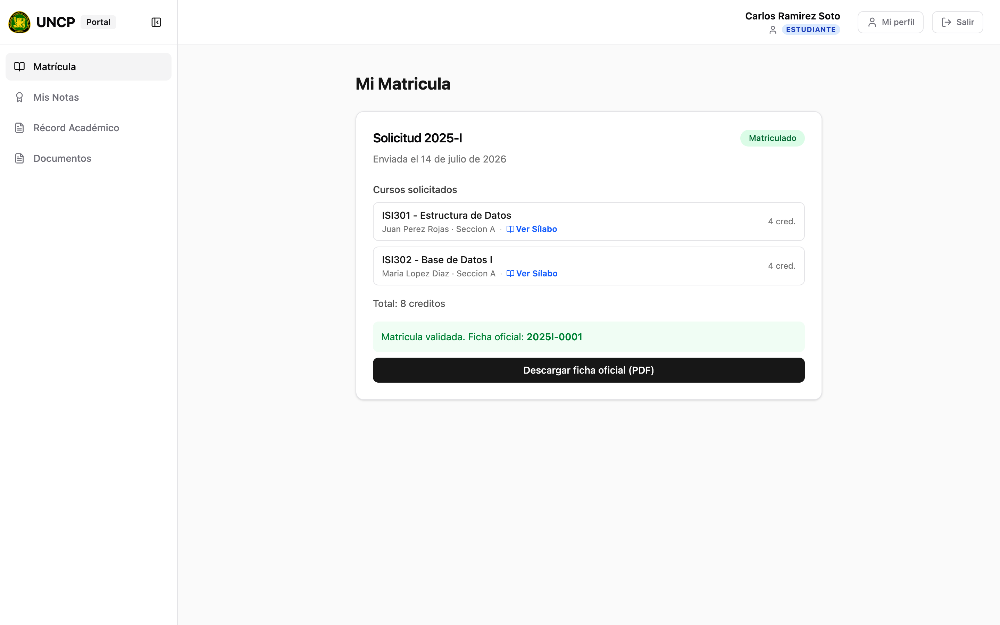

**Vista del administrador — Solicitudes de Matrícula:**

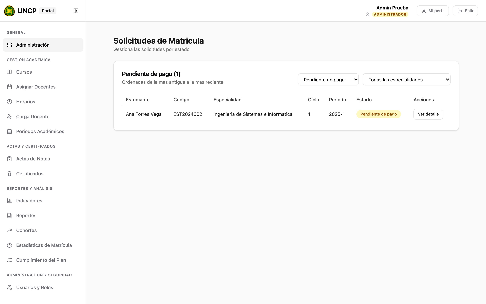

## 7.2 Módulo de Cursos y Docentes

- **Docente:** visualiza cursos asignados, gestiona sílabos y ve su horario.
- **Administrador:** asigna docentes y gestiona horarios.
- **Dirección:** evalúa carga docente y cumplimiento del plan de estudios.

**Vista del docente — Mis Cursos Asignados:**

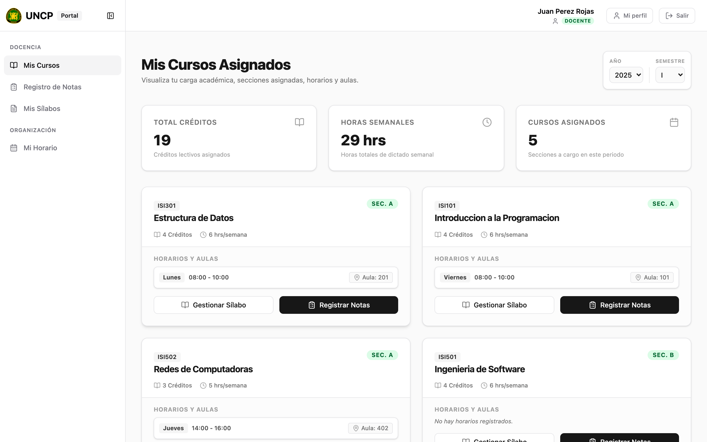

**Vista del docente — Mi Horario:**

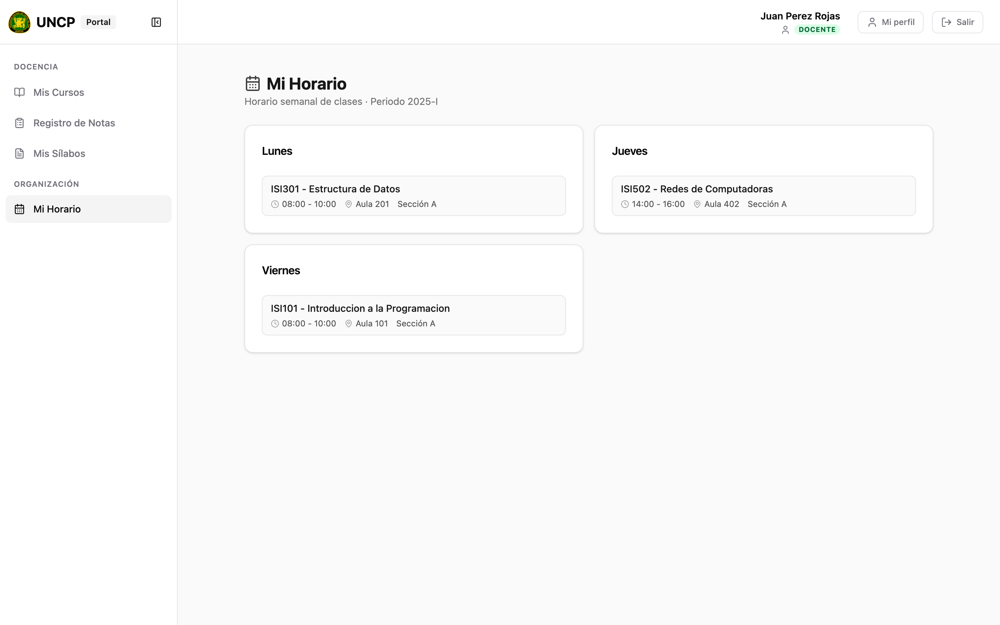

## 7.3 Módulo de Notas

- **Docente:** registra notas parciales y finales.
- **Estudiante:** consulta su hoja de notas por ciclo.
- **Administrador:** valida actas y consolida notas.
- **Dirección:** supervisa indicadores académicos.

**Vista del estudiante — Mis Notas:**

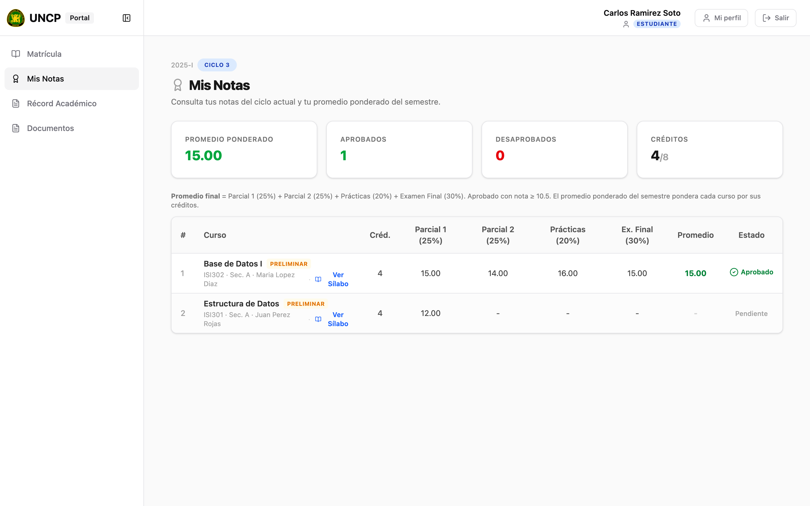

## 7.4 Módulo de Récord Académico

Centraliza el historial de rendimiento. El estudiante ve su historial semestre por
semestre con sus indicadores (promedio ponderado acumulado, créditos aprobados y
cursos aprobados), y cada curso con sus notas, promedio y estado
(Aprobado / Desaprobado / Pendiente).

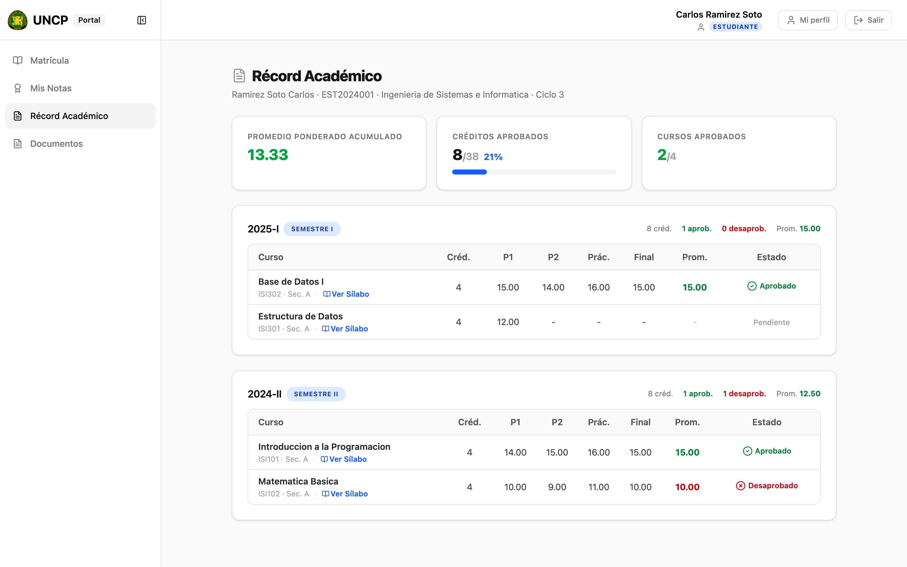

## 7.5 Módulo de Certificados y Documentos

Digitaliza la emisión de documentos oficiales con el flujo
**solicitud → autorización → emisión**, con **verificación por código QR**.

**Vista del estudiante — Mis Documentos:**

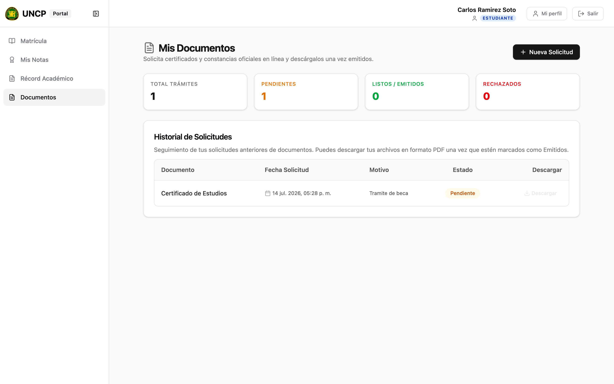

**Vista del administrador — Emisión de certificados:**

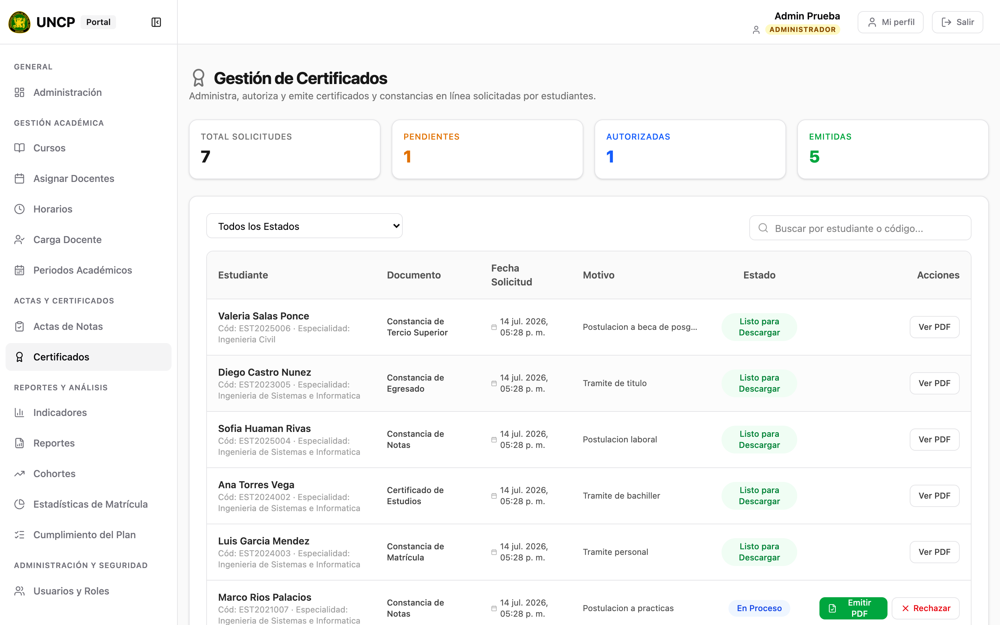

## 7.6 Módulo de Administración y Seguridad

Controla quién puede hacer qué: define roles, registra todo lo que pasa (auditoría)
y bloquea accesos no autorizados.

**Gestión de usuarios y roles (administrador):**

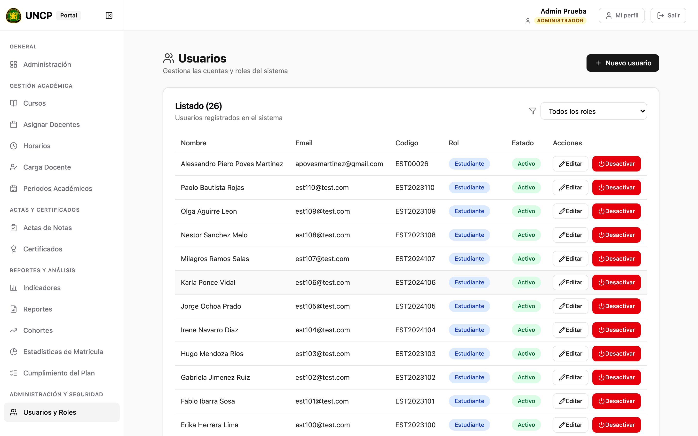

**Auditoría (dirección):**

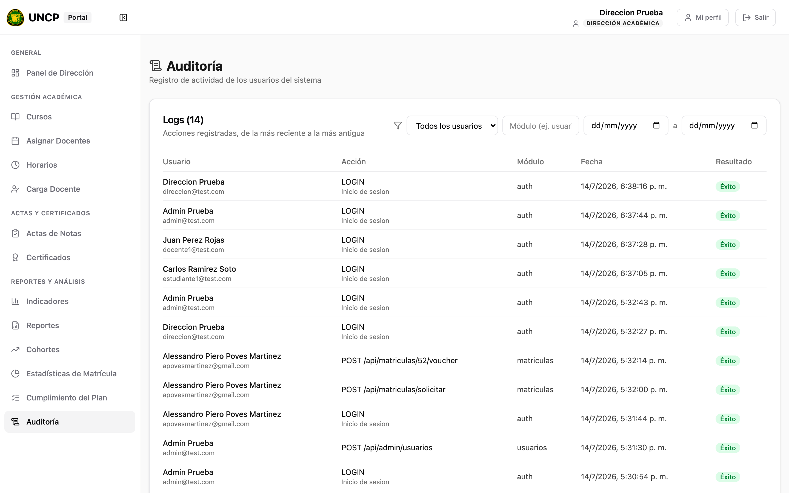

## 7.7 Funcionalidades adicionales

- **Periodos académicos:** crear y activar el periodo (base de todo el sistema).
- **Facultades y especialidades:** estructura académica.
- **Mi perfil:** datos personales y cambio de contraseña.
- **Panel de Dirección e indicadores:** métricas y gráficos de gestión.

**Periodos académicos (admin):**

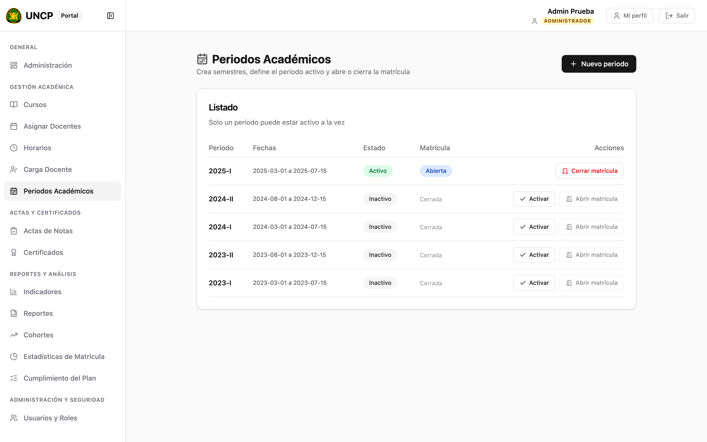

**Facultades y especialidades (admin):**

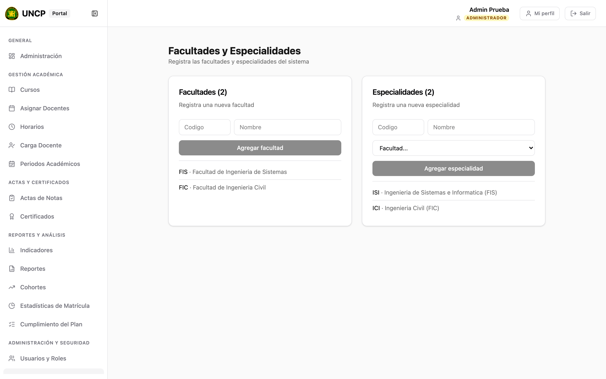

**Mi perfil:**

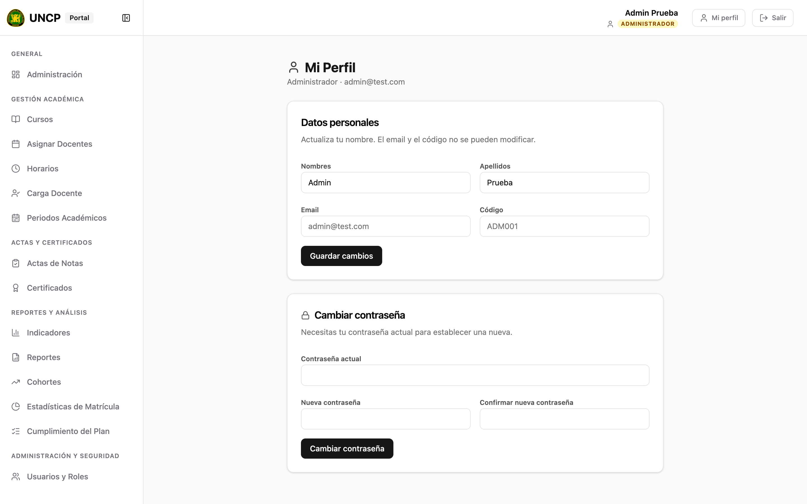

**Panel de Dirección:**

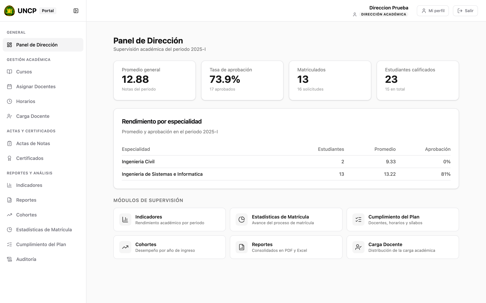

**Indicadores (dirección):**

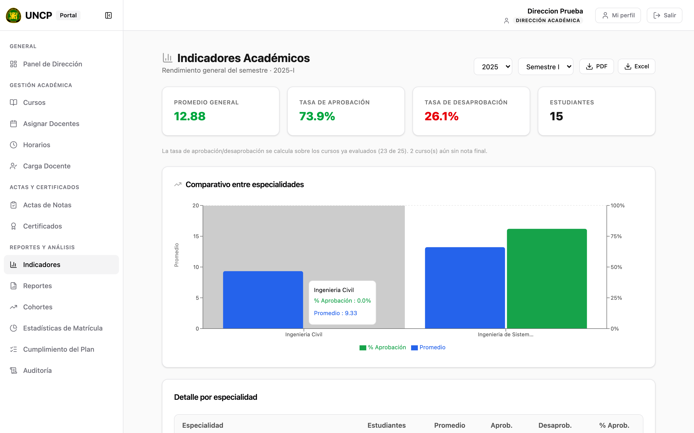
